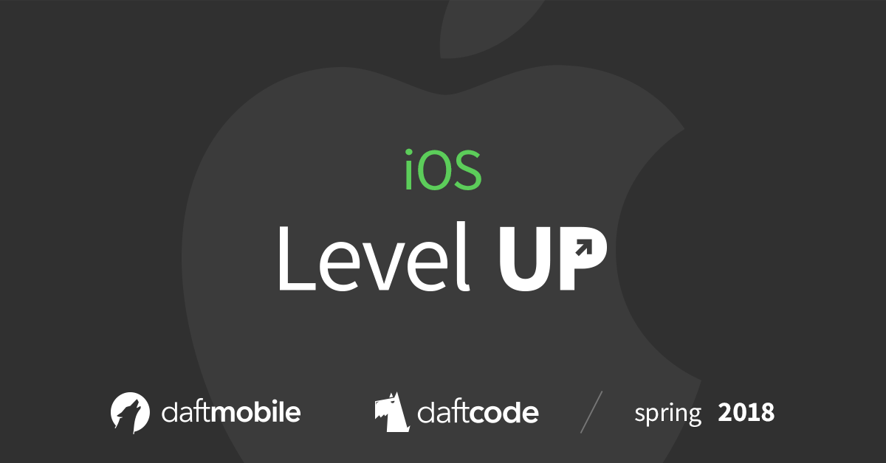

# iOS Level Up class – MiMUW, Spring 2018

## Classes

### Class 1: UIKit Animations, Gesture Recognition

## Resources

- [Install Swift on Linux](https://swift.org/download/#releases) - we're using version `4.0`
- [Open Source Swift](https://swift.org)
- [Free Swift Book](https://itunes.apple.com/us/book/the-swift-programming-language/id881256329?mt=11)
- [iOS Documentation](https://developer.apple.com/documentation/)
- [Apple Development Videos](https://developer.apple.com/videos/)

## Contact

- [E-mail](mailto:michal.dabrowski+mimuw@daftcode.pl)
- [Twitter](https://twitter.com/mdab121)
