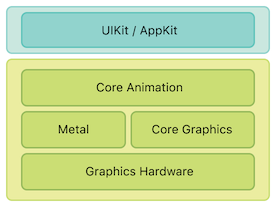
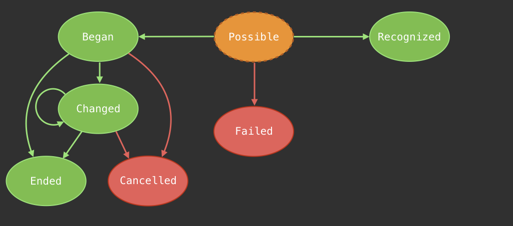

[](https://github.com/DaftMobile/ioslevelup_2018)


# iOS Level Up class – MiMUW, Spring 2018


## Classes

### Class 1: UIKit Animations, Gesture Recognition

#### Animations

UIKit animations are simple and easy to master! UIKit is a high level UI Framework, based on Core Animation. Core Animation animations are much more customizable than UIKit's, but UIKit will make it simple to get you started.

[](https://developer.apple.com/library/content/documentation/Cocoa/Conceptual/CoreAnimation_guide/Introduction/Introduction.html)

The simplest animation API looks like this:

```swift
let someView = ... // some view
UIView.animate(withDuration: 0.4) {
  someView.alpha = 0.3
}
```

You can also customize your animation timing functions, and add completion closures like this:

```swift
UIView.animate(withDuration: 0.2, delay: 0, options: [.curveEaseInOut], animations: {
  someView.alpha = 0
}, completion: { completed in
  someView.removeFromSuperview()
})
```

This makes it really easy to chain your animations - just add a new one in the completion closure of the previous one!

There is also a new animation API – `UIViewPropertyAnimator`. It's far more customizable and it's able to handle **interactive** and **interruptible** animations! Both topics are too advanced for this class, but you can learn more [here](https://developer.apple.com/documentation/uikit/uiviewpropertyanimator).

To just use `UIViewPropertyAnimator`, you first create an animator, and then call `startAnimation()` on it.

```swift
let animator = UIViewPropertyAnimator(duration: 0.2, curve: .easeInOut) {
  someView.frame = someView.frame.offsetBy(dx: 100, dy: 0)
}
animator.startAnimation()
```

#### Gestures

Touch detetection on iOS is done using the `UIGestureRecognizer` system. It makes it really simple to handle gesture detection. `UIGestureRecognizer` is an abstract class. To add gesture handling you need three basic steps:

1. Instantiate a concrete Gesture Recognizer (for example `UITapGestureRecognizer`) with a target-action.
2. Optional: configure the gesture
3. Add your gesture to a view.

Gestures on iOS are handled by the gesture system. Each gesture recognizer instance is responsible for recognizing **one** gesture.

There are two types of `UIGestureRecognizer` subclasses. These are discreet and continous gestures. Each gesture operates using a state machine. Discreet gestures are either recognized or failed (tap, swipe). Continous gestures begin at some point, and take a while to complete (for example a pan – user starts panning, continues for a while, and then lifts off their finger). Each gesture state machine looks as following:



All gestures start in the state `possible`, and then move either to `failed` or `recognized` (discreet gestures) and `began` (for continous gestures). It's a race condition – whichever recognizer recognizes **first** gets to handle the gesture until it's finished. You can override this behaviour for raw gesture handling using methods like `delaysTouchesBegan` for mixing with raw touch handling, or gesture recognizer delegates for interactions between gestures.

You can also subclass `UIGestureRecognizer` and use its API to create your own gestures. You just have to follow this state machine graph, as well as follow the rule *fail as quickly as possible* (which all gestures should do), and you'll get your own gesture recognizer which just works great with the whole gesture system.

See more [here](https://developer.apple.com/documentation/uikit/uigesturerecognizer).

_Workshop:_

**See the workshop assignment [here](Class1/Workshop/workshop1.md).**

### Class 2: Scroll it ∞! UIScrollView

#### Simple Scrolling

We talked about `UIScrollView`. It's used throughout UIKit (`UITableView`, `UICollectionView` are subclasses of `UIScrollView`. ScrollViews are used all over Springboard, iOS Home Screen, etc).

To use Scroll View you just need to set one property – its `contentSize: CGSize`. This is the size of the content that the user will be to scroll aroud. Just add your subviews to the ScrollView, and start using it.

The current scroll position of the scroll view is represented by a single point: `contentOffset: CGPoint`. It's the point in the scrollView's coordinate system currently visible in its top left corner.

_Note: Using `UIScrollView` with AutoLayout is a different approach to the one we're taking in this class. To learn how to use `UIScrollView` with AutoLayout, see the [documentation](https://developer.apple.com/library/content/documentation/UserExperience/Conceptual/AutolayoutPG/WorkingwithScrollViews.html)._

#### Advanced techniques

If you've ever used `UITableView` before, you probably have used subview tiling. The basic idea is to only load and show the contnent that will be actually visible, instead of the whole view hierarchy.

Sometimes you also want to add some stationary views (views that don't scroll with the content), but you want them to be subviews of the scroll view (for some reason).

In both cases, you need to dynamically manipulate frames of the subviews. There are two methods that you can use to implement tiling and hook up to `UIScrollView` behaviour.

`layoutSubviews` is the `UIScrollView` method that is called on **each frame** of scrolling. You can subclass `UIScrollView` and add your custom logic there.

```swift
override func layoutSubviews() {
  super.layoutSubviews()
  // custom logic here
}
```

The second method which is called on **each frame** is the scrollview delegate method `scrollViewDidScroll`. You can use it if you don't want to subclass `UIScrollView` directly and add your logic there.

```swift
func scrollViewDidScroll(_ scrollView: UIScrollView) {
  // custom logic here
}
```

#### Infinite scrolling

When you're familiar with the techniques described above, it's really straightforward to add things like infinite scrolling. Just position your `contentOffset` in the center of the scrollView's `contentSize`. After the user scrolls for a while, recenter the scrollview (either in `layoutSubviews` or `scrollViewDidScroll`) and move your content by the same amount. As long as you do this in the same call of your run loop, it'll be completely transparent to the user, and they won't be able to see what's going on.


### Class 3: CollectionView i Layout: Napisz swój własny Layout do CollectionView

_TODO_

### Class 4: Store it!: Podstawy Core Data

_TODO_

### Class 5: Instruments 101: Profilowanie aplikacji i naprawa błędów

_TODO_

## Resources

- [Install Swift on Linux](https://swift.org/download/#releases) - we're using version `4.0`
- [Open Source Swift](https://swift.org)
- [Free Swift Book](https://itunes.apple.com/us/book/the-swift-programming-language/id881256329?mt=11)
- [iOS Documentation](https://developer.apple.com/documentation/)
- [Apple Development Videos](https://developer.apple.com/videos/)

## Contact

- [E-mail](mailto:michal.dabrowski+mimuw@daftcode.pl)
- [Twitter](https://twitter.com/mdab121)
